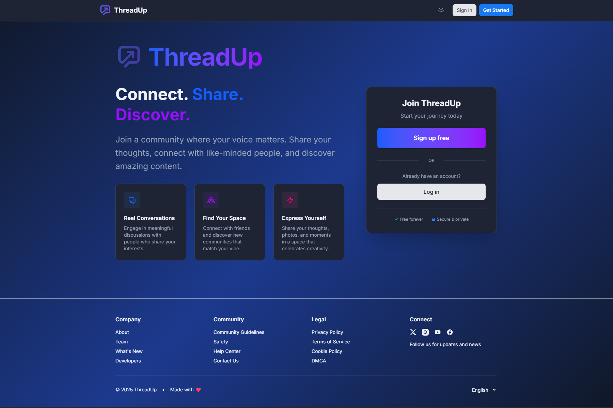

<div align="center">


# ThreadUp

**A Privacy-First Social Media Platform**

_Connect authentically. Share freely. Own your data._

[](https://nextjs.org/)
[](https://react.dev/)
[](https://www.typescriptlang.org/)
[](https://nodejs.org/)
[](https://www.mongodb.com/)

[🌐 Live Demo](https://threadup-client.onrender.com/) • [📖 Documentation](#documentation) • [🚀 Quick Start](#quick-start)

</div>

---

## What is ThreadUp?

ThreadUp is a **modern social media platform** built with privacy and authenticity at its core. Unlike traditional social networks that collect vast amounts of personal data and manipulate feeds with opaque algorithms, ThreadUp takes a different approach:

- **Minimal Data Collection** - We only store what's necessary: name and email
- **100% Open Source** - Every line of code is transparent and auditable
- **Community-Driven** - Built on user feedback and contributions
- **Ad-Free Experience** - No tracking, no sponsored content, no manipulation

<div align="center">
  
  <br>
  <!-- <em>Clean, chronological feed without algorithmic manipulation</em> -->
  <em>The initial view for unauthenticated users on ThreadUp</em>
</div>

---

## Key Features

### Privacy & Security

- **JWT Authentication** with HTTP-only cookies
- **Email Verification** for secure account creation
- **bcrypt Password Hashing** with strong requirements
- **Privacy-Oriented** data handling
- **No Third-Party Tracking** - your data stays yours

### Social Interaction

- **Posts & Images** - Share thoughts with up to 500 characters
- **Nested Comments** - Engage in threaded discussions
- **Like System** - Show appreciation for posts and comments
- **Follow Users** - Build your personalized network
- **Smart Suggestions** - Discover users based on organic interactions

### User Experience

- **Dark/Light Themes** - Seamless theme switching
- **Responsive Design** - Perfect on any device
- **Image Cropping** - Advanced drag-and-resize tool
- **Real-Time Updates** - Instant feedback on all interactions
- **Emoji Picker** - Express yourself with emojis

### Profile Management

- **Avatar Upload** - High-resolution profile pictures
- **Email & Password Changes** - Secure verification flows
- **Account Deletion** - Complete data removal on request
- **Activity Timeline** - Chronological post history

### Feed Options

- **Recent** - Latest posts from all users
- **Trending** - Most liked and commented content
- **Following** - Posts from users you follow
- **No Algorithmic Manipulation** - You decide what you see

### Admin Tools

- **Content Moderation** - Transparent admin actions
- **Activity Logs** - Complete audit trail
- **Platform Statistics** - Anonymous usage metrics
- **Admin Badges** - Clear identification of moderators

---

## Architecture

ThreadUp is built with a modern, scalable tech stack:

### Frontend

- **Next.js 15** - React framework with App Router
- **React 19** - Latest with Server Components
- **TypeScript** - Type-safe development
- **Tailwind CSS 4** - Utility-first styling

### Backend

- **Node.js & Express** - Fast, scalable API
- **TypeScript** - End-to-end type safety
- **MongoDB** - Flexible document database
- **Mongoose** - Elegant object modeling

### Infrastructure

- **Cloudinary** - Optimized image delivery
- **Resend** - Reliable email service
- **Render.com** - Modern hosting platform
- **GitHub** - Version control and collaboration

---

## Quick Start

### Prerequisites

- Node.js 18+ installed
- MongoDB instance (local or Atlas)
- npm or yarn package manager

### Installation

```bash
# Clone the repository
git clone https://github.com/lucasxbron/ThreadUp.git
cd ThreadUp

# Install server dependencies
cd server
npm install
cp .env.example .env
# Configure your .env file with required credentials

# Install client dependencies
cd ../client
npm install
cp .env.local.example .env.local
# Configure your .env.local file

# Start development servers
# Terminal 1 - Backend
cd server
npm run dev

# Terminal 2 - Frontend
cd client
npm run dev
```

Visit `http://localhost:3000` to see ThreadUp in action!

---

## Documentation

Comprehensive technical documentation is available for developers:

- **[Client Documentation](client/README.md)** - Frontend architecture, components, and features
- **[Server Documentation](server/README.md)** - Backend API, authentication, and database
- **[API Testing Guide](server/docs/API_REFERENCE.md)** - Complete API Reference collection and testing instructions

### Quick Links

- [Environment Configuration](server/README.md#environment-configuration)
- [API Endpoints](server/README.md#api-endpoints)
- [Database Schema](server/README.md#database-schema)
- [Component Overview](client/README.md#components-overview)
- [Admin Management](server/README.md#admin-management)

---

## Community & Support

### Get Help

- **Contact Form** - [threadup-client.onrender.com/contact](https://threadup-client.onrender.com/contact)
- **Help Center** - [threadup-client.onrender.com/help](https://threadup-client.onrender.com/help)
- **Report Issues** - [GitHub Issues](https://github.com/lucasxbron/ThreadUp/issues)

### Legal & Guidelines

- [Privacy Policy](https://threadup-client.onrender.com/privacy)
- [Terms of Service](https://threadup-client.onrender.com/terms)
- [Community Guidelines](https://threadup-client.onrender.com/guidelines)
- [Cookie Policy](https://threadup-client.onrender.com/cookies)

---

## Our Vision

**ThreadUp** proves that social media can work differently - without data exploitation, without manipulation, without advertising.

We believe in:

- **Transparency** - Open source code, clear policies
- **Privacy** - Minimal data collection, maximum user control
- **Authenticity** - Chronological feeds, no algorithmic bias
- **Community** - User-driven development and moderation

Social media should connect people, not divide them. ThreadUp is our contribution to a more responsible and transparent digital future.

---

<!-- ## Roadmap

Future enhancements we're exploring:

- Native mobile applications
- Real-time notifications
- Video support
- Advanced search functionality
- Enhanced analytics for users

--- -->

## Contributing

We welcome contributions from the community! Whether it's:

- Bug reports
- Feature suggestions
- Documentation improvements
- Code contributions

Check out our [GitHub repository](https://github.com/lucasxbron/ThreadUp) to get involved.

---

## License

This project is part of the ThreadUp social media platform. All rights reserved.

---

<div align="center">

**Built with ❤️ for a better social web**

[Visit ThreadUp](https://threadup-client.onrender.com/) • [Star on GitHub](https://github.com/lucasxbron/ThreadUp) • [Share Feedback](https://threadup-client.onrender.com/contact)

---

_ThreadUp - Connect authentically. Share freely. Own your data._

</div>
